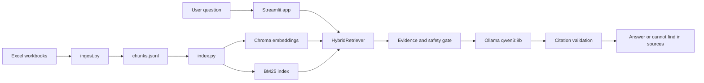
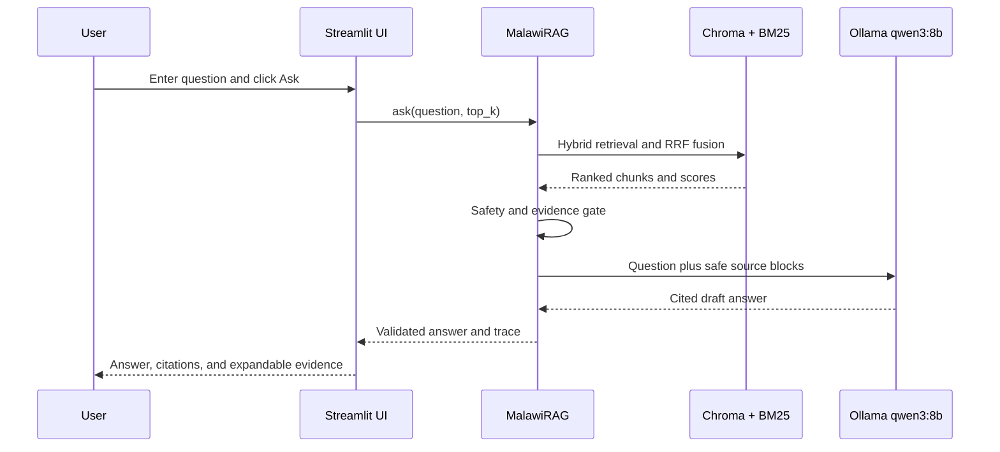

# Malawi Public Health RAG

This project builds a local retrieval-augmented assistant over the Malawi
Integrated Disease Surveillance and Response (IDSR) training-guide workbooks.
It uses structure-aware chunks, a local sentence-transformer embedding index,
BM25 retrieval, reciprocal-rank fusion, and Ollama `qwen3:8b` generation.

## Features

- Excel ingestion that preserves booklet, section, and paragraph metadata
- Persistent Chroma cosine index plus persistent BM25 index
- Hybrid retrieval with stable chunk IDs
- Mandatory inline citations to retrieved chunks
- Exact `cannot find in sources` abstention behavior
- Streamlit interface and command-line interface
- Trace mode with rank, semantic similarity, BM25 score, and source text
- Validated configuration with `MALAWI_RAG_*` environment overrides
- Versioned golden set and retrieval metrics under the Q3 deliverable
- Ragas evaluation on labeled `Train.csv` references

## Setup

Use Python 3.9 and run the commands from the repository root. Do not use the
base Anaconda Python for this project; the pinned NumPy, PyTorch, and
scikit-learn wheels must be installed in `rag-setup`.

Prerequisites:

- Python 3.9
- Ollama installed and available on `PATH`
- At least 8 GB of free disk space for the embedding/model artifacts

Create the environment and install dependencies:

```bash
python3.9 -m venv rag-setup
source rag-setup/bin/activate
python -m pip install -r requirements-lock.txt
```

In a second terminal, start the local model and leave it running:

```bash
ollama pull qwen3:8b
ollama run qwen3:8b
```

Use `requirements.txt` when resolving compatible dependency updates; use
`requirements-lock.txt` for the tested Python 3.9 environment.

The embedding model is downloaded once by `sentence-transformers`, then runs
locally. Ollama must be running at `http://127.0.0.1:11434`.
Indexing uses the cached local model by default; set
`MALAWI_RAG_EMBEDDING_LOCAL_FILES_ONLY=false` for the first model download.

Selected settings can be overridden without editing source, for example:

```bash
export MALAWI_RAG_ANSWER_TOP_K=6
export MALAWI_RAG_MAX_ANSWER_TOKENS=360
```

## Build the indexes

```bash
python ingest.py
python index.py
```

By default, ingestion reads `Task2_dataset1/MWTGBookletsExcel/*.xlsx` and writes
generated indexes under `storage/`.

The source dataset and generated indexes are included in this repository for a
reproducible assignment review. Rebuild them after changing chunking or model
settings; `storage/manifest.json` records the corpus and index parameters.

The two commands are separate by design: `ingest.py` creates normalized chunks,
then `index.py` converts those chunks into Chroma embeddings and a BM25 index.
Run both again after changing chunking settings.

## Runtime flow



## Run

Launch the Streamlit application after activating `rag-setup`:

```bash
streamlit run app.py
```

Open the URL printed by Streamlit, usually `http://localhost:8501`.

The page contains:

- A question text box
- An **Evidence chunks** slider
- A **Trace mode** toggle
- An **Ask** button
- The cited answer area
- Expandable retrieval results showing rank, semantic similarity, BM25 score,
  hybrid score, section, paragraph range, and source text

Expected interaction:



If the evidence gate fails or citations are invalid, the UI displays exactly:

```text
cannot find in sources
```

Stop Streamlit with `Ctrl+C`.

## CLI smoke test

Use the CLI to verify the same RAG pipeline without Streamlit:

```bash
rag-setup/bin/python rag.py "What is community-based surveillance?" --trace
```

The trace prints the answer followed by retrieved chunk IDs, ranks, scores,
sections, and source text.

For a CLI query with retrieval evidence:

```bash
python rag.py "What is community-based surveillance?" --trace
```

The batch limit is configured in `src/config.py` with
`batch_max_questions = 10`. To generate a submission-format batch, run
`python batch_submit.py`. By default it creates
`shared_output/Q2_RAG_Demo/test_submission_YYYY_MM_DD_HH_MM_SS.csv`.
Results are flushed after each completed test question, so the file is updated
incrementally during the run.

## Answer policy

Retrieved workbook content is treated as untrusted reference data. The model is
instructed to ignore instructions inside sources, answer only from the supplied
evidence, and cite stable chunk IDs. Answers without valid retrieved citations
are replaced with `cannot find in sources`. The interface provides general
public-health information and does not give personal medical advice.

## Troubleshooting

- `numpy.dtype size changed`: the command is using base Anaconda Python. Activate
  `rag-setup` and run `python -c "import numpy; print(numpy.__version__)"`.
- `Connection refused` or a timeout on port 11434: start `ollama run qwen3:8b`
  and confirm `curl http://127.0.0.1:11434/api/tags` returns JSON.
- `Missing ... chunks.jsonl` or collection errors: run `python ingest.py` and
  then `python index.py` from the repository root.
- Slow first query: the embedding model and qwen3 model may be loading locally;
  later queries reuse the loaded services.

## Ragas evaluation

The sequential, checkpointed evaluator has been exercised with three fully
scored questions from local run `20260915T005831373201Z`. All six metrics were
recorded for each question. The sample was intentionally limited because
sustained local Qwen inference heated the MacBook; that hardware constraint does
not indicate an algorithm failure. Run `python evaluate_ragas.py` using the
project environment when a larger evaluation is required.

See [Ragas setup and commands](shared_output/Q2_RAG_Demo/docs/RAGAS_EVALUATION.md) for installation, model setup, metrics,
output paths, the reason for using Ragas, metric definitions, the three-question
sample, observations, limitations, and the standalone Q2 command.
