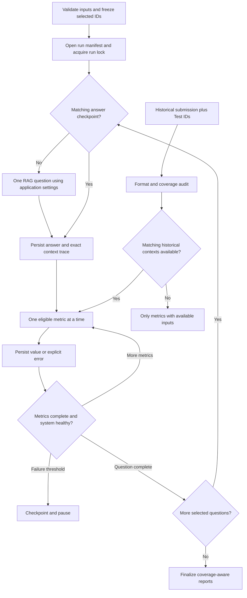

# Agent Ragas Evaluation Plan

Date: 2026-09-14
Status: **Proposed — documentation only; implementation and scoring pending**
Target: MacBook M1, 16 GB unified memory; local Ollama `qwen3:8b`.

## 1. User request and scope

Design a complete, reproducible Ragas evaluation of the local Malawi RAG system. Decide how Train.csv, Test.csv, SampleSubmission.csv, and timestamped predictions should be used; include relevant metrics, resource controls, persistence, and documentation requirements.

**Latest instruction takes precedence:** create this plan only. Do not install dependencies, modify application code, start evaluations, regenerate PDFs, commit, or push as part of this planning task. Earlier prototype code and dependency edits already exist; their presence does not demonstrate a working evaluation. Preserve them for subsequent review rather than automatically reverting user work.

Maintain this file by appending dated decisions, implementation evidence, and corrections inside the relevant sections. Keep previous entries as history. Never describe planned results as measured scores.

## 2. Problem and current evidence

The assessment must distinguish retrieval coverage, answer grounding, reference correctness, abstention behavior, and submission integrity. There is no single score that proves the complete model is correct.

Read-only inspection on this date found:

| Input | Observed records | Schema / purpose |
|---|---:|---|
| `Task2_dataset1/Train.csv` | 748 | ID, Question Text, Question Answer, Reference Document, Paragraph(s) Number, Keywords |
| `Task2_dataset1/Test.csv` | 499 | ID, Question Text; no reference answers |
| `Task2_dataset1/SampleSubmission.csv` | 1,996 | ID, Target; four target rows per question, blank template values |
| `shared_output/Q2_RAG_Demo/test_submission_2026_09_14_21_30_21.csv` | 12 | Three question groups at inspection time; may be an incomplete or ongoing run |

These counts were read with a CSV parser, not physical line counting. Revalidate them at execution time and record input hashes. Root and packaged datasets/configurations must also be checked for drift before choosing a run target.

Existing `evaluate_ragas.py` is an unfinished prototype. Previous attempts encountered an event-loop error and local judge timeouts; no valid completed Ragas score report has been established in this work. Earlier README wording suggesting a completed evaluation must be corrected during implementation.

## 3. Dataset decisions

### 3.1 Labeled quality benchmark

Use Train.csv references to evaluate freshly generated answers from the actual application pipeline. Never supply Question Answer, gold paragraphs, or gold documents to generation or restrict retrieval to them. Only questions and normal application settings go to RAG; references go to the evaluator.

Audit missing values, duplicate IDs/questions, conflicting labels, document aliases, and paragraph references first. Group exact and near-duplicate questions before splitting. Persist an immutable split manifest with a fixed seed (proposed 42), IDs, hashes, and exclusions with reasons.

Use approximately 80% of eligible groups for development and 20% as a held-out validation subset, balancing booklet coverage and multi-source questions where feasible. Actual counts depend on the audit; do not preclaim an exact split size. Existing use of Train.csv for tuning means this is an internal validation benchmark, not proof of an untouched external test set. Record known prior exposure.

Stages:

1. One labeled development item: adapter/schema/context validation.
2. Three development items spanning short and multi-source answers: timing and resource pilot.
3. Ten fixed development items: default smoke run (`max_questions = 10` in a dedicated configuration file).
4. A broader development run followed by frozen held-out validation after settings are fixed.
5. Optional all-Train diagnostic report, clearly labeled as such and separate from held-out results.

Do not use the first ten rows as a representative benchmark. Save the selected IDs, selection rules, and profile so comparisons use identical questions. Retain the existing Q3 golden set for complementary answerable/unanswerable and adversarial checks; it is not automatically an independent validation set.

### 3.2 Unlabeled test questions and historical submissions

Join each prediction to Test.csv by question ID, never row position. Parse known suffixes exactly: `_keywords`, `_paragraph(s)_number`, `_question_answer`, `_reference_document`. Validate against the actual sample template IDs.

SampleSubmission.csv defines required schema and identifiers only. It is not gold data. Blank sample values and a previous prediction must never become reference answers.

Historical CSVs support checks of duplicate/missing/unknown IDs, four-field completeness, nonempty answers, abstention rate, valid document names, and parsable paragraph references. A configured partial run is not a failed full submission: report both selected-question completeness and coverage of all 499 test questions.

Answer relevancy can be assessed without gold answers. Faithfulness additionally requires the exact contexts used for that historical answer. Current submission CSVs do not preserve that trace. Mark historical faithfulness as unavailable unless a matching trace exists; reretrieving today's contexts cannot establish the original answer's grounding. A replay is a new run with new provenance.

Do not infer latency or model/configuration from a filename. Timestamp ordering alone does not prove which partial run is suitable for comparison. Require an explicit run selection or validated completed manifest; compare only common IDs and report coverage differences. Snapshot/hash files to avoid reading partially appended groups from a running submission.

## 4. Metric suite and reporting rules

| Metric | Inputs | Use / interpretation |
|---|---|---|
| Ragas faithfulness | Answer + exact generation contexts | Whether answer claims are supported by provided evidence |
| Ragas answer relevancy | Question + answer, local judge/embeddings | Whether the answer addresses the question; not a correctness test |
| Ragas context precision | Question + ordered retrieved contexts + reference | Relevance and ordering of retrieved evidence |
| Ragas context recall | Retrieved contexts + reference answer | Coverage of reference facts in retrieved evidence |
| Ragas answer correctness / factual correctness | Answer + reference, according to pinned API | Reference-based factual quality; explicitly record chosen metric and formula |
| Ragas answer semantic similarity | Answer + reference embeddings | Supporting similarity diagnostic, not factual correctness |
| Deterministic Recall@k, Hit@k, MRR, full-evidence recall | Audited gold evidence + ranked results | Retrieval performance at k = 1, 3, 6, 10 from one retrieval where possible |
| Citation validity and evidence coverage | Answer citations + exact supplied source IDs | Syntax/allow-list validity; distinguish from claim-level support |
| Abstention coverage and correctness | Abstention status + audited answerability | Report false abstention on answerable questions and correct abstention on unanswerable ones |
| Runtime and submission checks | Trace timing/errors + CSV IDs | Generation/judge latency, timeout/parse-failure rates, completeness |

Resolve names, required fields, score ranges, and normalization against the chosen pinned Ragas version. Old and new APIs use different names; do not mix their schemas or label one metric with another's name. Do not assume all similarity outputs are calibrated probabilities. Reference context precision/recall are judge estimates, not the deterministic evidence metrics above.

Gold paragraphs need a validated document-and-paragraph-to-chunk mapping. Handle aliases, ranges, multiple documents, overlap, and split paragraphs. Preserve ambiguous cases as excluded/unresolved with counts; never silently assign a paragraph to an arbitrary document. For overlapping chunks, use evidence-unit recall or define equivalent chunk groups so duplicate representations do not inflate the gold denominator.

Report retrieval metrics on full ranked retrieval. Report answer faithfulness on only the safe, budget-selected contexts actually sent to generation. Optionally report context recall for both sets under distinct labels to expose losses from safety filtering or context budgeting.

Handle abstentions explicitly: do not assign perfect faithfulness to an empty claim set. Preserve raw metric output and mark undefined metrics not applicable. Show answered-only metrics alongside answer coverage, false abstention, and whole-set quality measures. Never hide abstentions or errors by reporting only successful answers.

Do not create a weighted overall score initially. Publish per-metric mean, valid count, total eligible count, missing/error count, and coverage. Include distribution/low-score examples and, for a sufficiently large benchmark, uncertainty intervals; ten rows are only a smoke test. Compare paired question results across runs. A null from a timeout is not zero, and an all-null run is failed, not a successful benchmark.

Local Qwen judging its own answers has correlated bias. Use temperature zero for judging, record model digest and prompts, and manually review a small fixed sample including disagreements, low scores, and abstentions. Reference answers may be incomplete or erroneous: record annotation issues without silently rewriting labels to improve scores.

## 5. M1 / 16 GB execution design

### 5.1 Bounded concurrency

Use one evaluation process, one question in flight, one metric job in flight, and one active Ollama request across answer generation, repair, retries, and judging. No multiprocessing pool, process-per-question workers, unbounded `gather`, or full-dataset submission of async jobs.

The outer loop processes a question and its metrics sequentially. If the selected Ragas API needs async execution, use one owned event loop with its semaphore created within that loop. Set supported worker controls to one as a second guard. A thread lock around HTTP requests alone is insufficient: many waiting jobs may still exhaust their metric timeouts.

Use one application run lock to prevent a second evaluator or coordinated batch runner from competing. Explain that unrelated clients are not covered by this lock. Before long runs, check for active batch generation or interactive Ollama requests; schedule evaluation when they are idle. Do not kill user processes automatically.

Ollama server settings proposed for the evaluation session are `OLLAMA_NUM_PARALLEL=1` and `OLLAMA_MAX_LOADED_MODELS=1`. They must apply to the process launching the server; exporting them in a client terminal does not reconfigure an already-running macOS Ollama app. Verify effective server behavior during implementation. Do not spawn a duplicate server on port 11434.

### 5.2 Starting configuration, subject to pilot validation

| Parameter | Proposed default |
|---|---|
| Maximum evaluation questions | 10; independent of `batch_max_questions` |
| Selection seed | 42 |
| Python evaluation processes | 1 |
| In-flight questions / metric jobs / Ollama requests | 1 / 1 / 1 |
| Generation model | Existing `qwen3:8b` and recorded digest/quantization |
| Judge model | Reuse the same loaded model initially |
| Judge temperature / thinking | 0 / disabled if supported |
| Generation settings | Unmodified application settings, recorded in manifest |
| Judge context window | Start at 4,096 tokens; validate full prompt fit |
| Judge response budget | Start at 1,024 tokens; validate complete structured output |
| HTTP connect / read timeout | 10 / 300 seconds, adjustable after pilot |
| Metric wall-clock deadline | Start at 900 seconds including its bounded internal calls |
| Retries | At most one additional transient retry per call; one shared repair/retry budget |
| Embedding model/device | Reuse MiniLM, CPU, one instance per process |
| Embedding batch / CPU threads | 8 / 2 initially |
| Checkpoint | After each generated answer and each metric |

These are conservative starting choices, not measured performance guarantees. Cap tokenizer/BLAS threads before imports (`TOKENIZERS_PARALLELISM=false`, relevant OMP/BLAS thread settings) and PyTorch CPU threads at two; use no data-loader child workers. Keep embedding work sequential with inference. Preserve memory headroom for macOS and the IDE; observe memory pressure and swap growth, not just Python RSS because Ollama uses separate unified memory. Pause checkpointed work on sustained pressure instead of adding workers.

Verify whether the existing Python environment is arm64 or translated x86_64. Prior project notes describe a Python 3.9 Intel runtime even though the hardware is M1. Select and validate a compatible pinned Ragas/Python combination in an isolated evaluation environment if needed; do not upgrade the working app environment blindly. Avoid installing unrelated integrations or extra judge models.

### 5.3 Context fidelity and timeout behavior

Never shrink application context from 8,000 characters to 1,200, answer tokens to 64, or generation context to 1,024 merely to obtain a score. That changes the evaluated system and may make whole source blocks disappear. Reduced-resource application experiments need separate named profiles and must not be reported as the production baseline.

Ragas judge prompts include instructions, examples, source text, and structured outputs. Validate full prompt size plus output reserve against its context window. A 64-token judge limit can truncate JSON; it is not an adequate general solution. If prompts do not fit the proposed window, pilot a larger window only if memory permits, or record the affected metric as unsupported/overflow. Do not silently truncate evidence or invent a different metric by manually averaging arbitrary pieces.

Set timeout scope deliberately: a metric can make multiple model calls. Start its deadline when work actually begins, not while queued. Prevent nested retry multiplication. On timeout, cancellation must not allow another request to start while the old synchronous inference remains active. Confirm request drain/server readiness before retrying; otherwise checkpoint and stop. Never leave a thread pool draining dozens of abandoned requests.

Use a circuit breaker after three consecutive infrastructure failures or repeated malformed judge outputs. Save errors and pause; do not keep generating the entire dataset when the judge is broken. Show one concise progress line with question ID, stage, metric, completed/total, elapsed time, and failure count. Derive ETA only from measured completed work.

## 6. Proposed code organization (future implementation)

Keep application `Settings` and evaluation settings distinct. Store user-editable defaults in a dedicated file, proposed `evaluation_config.json`; limit must come from this file by default rather than a required terminal flag.

Proposed components:

- `EvaluationSettings`: validates profiles, limits, timeout/retry bounds, and paths.
- `DatasetProvider`: CSV parsing, ID validation, frozen selection, labeled/unlabeled adapters.
- `RAGTraceAdapter`: captures question, final answer, abstention reason, raw candidates, quarantined IDs, exact prompt-selected contexts, citations, and timings.
- `LocalJudgeAdapter`: version-compatible Ollama calls, schema validation, prompt-size checks, bounded requests.
- `MetricRunner`: sequential execution, supported metric registry, errors and applicability.
- `RunStore`: append-only checkpoints, cache keys, resume, manifest status and provenance.
- `ReportBuilder`: summaries, per-question CSV, Markdown, comparison reports.
- Thin `evaluate_ragas.py` entry point; lightweight tests separated from live integration tests.

Place reusable components under an evaluation package within `src/`, without creating a naming conflict with existing `src/evaluation.py`. Root source should be canonical; deliver a synchronized standalone Q2 package with local entry points and dataset paths. The current Q2 wrapper depending on the root script is not sufficient for an independently shared package. Resolve paths relative to the selected project/package root, not the caller's current directory.

## 7. Persistence, provenance, and resuming

Proposed outputs:

```text
shared_output/Q2_RAG_Demo/evaluation/
  splits/<split_version>.json
  runs/<UTC_timestamp>_<run_id>/
    manifest.json
    answers.jsonl
    metric_results.jsonl
    errors.jsonl
    per_question.csv
    summary.json
    report.md
  comparisons/<comparison_id>.md
```

Write and flush an answer trace immediately after generation, before any judge calls. Append each completed metric independently and flush it; use durable writes at question boundaries. Export CSV incrementally or atomically from the checkpoint log. Save a manifest before starting with status `running`; finalize as `completed`, `partial`, `failed`, or `cancelled`. Resume must tolerate an incomplete final JSONL line while preserving earlier valid entries.

Cache keys include question/input hashes, dataset/split versions, corpus/index manifest hash, code revision plus dirty-source fingerprint, application settings, model digest, exact ordered contexts, metric/Ragas version, judge prompt/settings, and reference hash. Resume only matching results. A failed judge retry reuses the saved answer; changing application settings invalidates answer cache; changing judge settings invalidates only metric cache.

Store raw judge responses/errors for diagnosis, with question and metric IDs. Preserve original citations and record any derived scoring text. Existing test CSV predictions with absent provenance must be labeled unknown, never given invented model/config metadata.

## 8. Prototype defects to resolve before running again

1. Ragas 0.1.21/Python 3.9 event-loop/semaphore failure: validate a supported combination or narrow adapter using public APIs; avoid global monkeypatching of `Executor.results` as the permanent design.
2. `max_workers=-1` enabled excessive concurrent work; a request lock still left queued metrics timing out. Enforce sequential scheduling before creating jobs.
3. Current answer dataset captures all `response.retrieved`, including potentially quarantined or omitted chunks. Extend trace capture to the actual generation inputs.
4. Current evaluation overrides change application budgets and thus benchmark a different system. Remove implicit overrides in future implementation.
5. Current runs regenerate all answers after scoring failures and save only at the end. Add checkpoint-first execution before another live run.
6. Judge response/context limits are too small for general structured metrics; timeout values differ between HTTP and Ragas layers. Validate budgets with one real item.
7. Preserve error coverage and stop on systemic failures; `raise_exceptions=False` alone must not imply success.
8. Resolve root/Q2 configuration drift and standalone paths while preserving the user's independent batch limit.
9. Check dependency-lock consistency and compatibility; do not present previously appended pins as a tested clean installation.
10. Existing evaluation documentation overstates readiness and excludes all test use too broadly: distinguish reference-free evaluation with adequate traces from unavailable supervised metrics.

## 9. Implementation gates after user authorizes implementation

- [ ] Inventory prototype changes; verify architecture, dependencies, corpus, and process status.
- [ ] Validate datasets and freeze development/validation IDs with leakage audit.
- [ ] Implement settings, trace capture, checkpoints, single-worker execution, and resumability first.
- [ ] Test ID suffix mapping, duplicate/missing records, context fidelity, budget overflow, partial files, timeout cancellation, and cache invalidation without live inference.
- [ ] Prove observed maximum in-flight judge requests stays at one, including repair/retry paths.
- [ ] Validate one labeled item end to end, every selected metric's schema and output, and an interruption/resume case.
- [ ] Pilot three items; record latency, judge call counts, structured-output success, and memory pressure. Tune resource controls without changing baseline semantics.
- [ ] Complete ten fixed development items; publish actual per-metric scores with valid/eligible counts and errors.
- [ ] Estimate larger-run cost using measured model-call times, not metric count alone. Schedule bounded runs on the frozen validation set.
- [ ] Audit historical test submissions separately; score reference-free metrics only when required inputs exist.
- [ ] Update README, Q2 design/evaluation report, Q3 evaluation discussion, and relevant generated DOCX/PDF documentation with measured results after implementation. Skip screenshots/video as previously requested.
- [ ] Verify standalone Q2 commands and focused application regression tests. No push unless requested for that work.

## 10. Required future score report

No evaluation scores are claimed by this plan. Future reports must include this table with actual values:

| Metric | Mean | Valid / eligible | Failed / not applicable | Split / profile |
|---|---|---|---|---|
| Faithfulness | Pending | Pending | Pending | Pending |
| Answer relevancy | Pending | Pending | Pending | Pending |
| Context precision | Pending | Pending | Pending | Pending |
| Context recall | Pending | Pending | Pending | Pending |
| Answer correctness / selected factual metric | Pending | Pending | Pending | Pending |
| Answer semantic similarity | Pending | Pending | Pending | Pending |

Include deterministic retrieval/citation results, abstention coverage, runtime, dataset hashes, sample size, model digest, code/settings provenance, and failure examples alongside this table. Never replace missing scores with fabricated numbers or assert full-model quality from a ten-item run.

## 11. Flow



## 12. References and decision log

Consult the documentation for the exact pinned version during implementation:

- [Ragas metric catalog](https://docs.ragas.io/en/latest/concepts/metrics/available_metrics/) — metric families and inputs; latest APIs are not automatically compatible with the prototype.
- [Ragas RunConfig documentation](https://docs.ragas.io/en/v0.2.0/howtos/customizations/_run_config/) — worker controls; version-specific behavior must be tested.
- [Ollama FAQ](https://docs.ollama.com/faq) — server concurrency/model-loading controls and memory scaling with parallel contexts.
- [Ollama context length](https://docs.ollama.com/context-length) — context configuration and memory considerations.

### 2026-09-14 — Planning-only scope confirmed

**Completed:** Inspected current evaluator, RAG generation/context selection, configuration, agent history, and input schemas/counts. Created this design with single-worker scheduling, input provenance, checkpointing, and explicit score applicability.

**Pending:** All implementation changes, validated Ragas scores, clean-environment checks, and report generation. Hardware resource values are proposed and require a pilot. Earlier failed attempts are diagnostic history, not benchmark evidence.

### 2026-09-15 — Three-question live Ragas evidence

**Completed:** Three questions from local run
`shared_output/Q2_RAG_Demo/evaluation/20260915T005831373201Z` were evaluated
with complete coverage of all six Ragas metrics: Q220, Q1016, and Q1226. This
provides 18 successful metric records for the reported sample.

**Measured results:** Across the three evaluated questions,
faithfulness was 0.8333, answer relevancy 0.8665, context precision 1.0000,
context recall 1.0000, answer correctness 0.9481, and answer similarity 0.8756.

**Interpretation:** This validates the live sequential answer/judge path and
checkpoint persistence. It is a small development sample rather than a held-out
quality claim. Local Qwen judges answers produced by Qwen, so correlated judge
bias remains. The sample was limited to three questions because sustained local
inference caused significant MacBook heat; this is a machine resource constraint,
not an observed algorithm failure. Detailed metric definitions are documented in
`shared_output/Q2_RAG_Demo/docs/RAGAS_EVALUATION.md`.

**Future extension:** Run a larger frozen held-out set on hardware suited to
sustained inference and retain human review of low-faithfulness cases.
