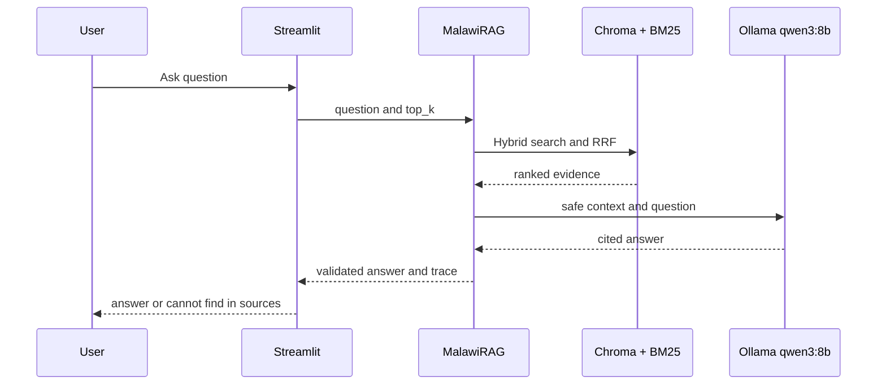

# Malawi Public Health RAG

This project builds a local retrieval-augmented assistant over the Malawi
Integrated Disease Surveillance and Response (IDSR) training-guide workbooks.
It uses structure-aware chunks, a local sentence-transformer embedding index,
BM25 retrieval, reciprocal-rank fusion, and Ollama `qwen3:8b` generation.

## Features

- Excel ingestion that preserves booklet, section, and paragraph metadata
- Persistent Chroma cosine index plus persistent BM25 index
- Hybrid retrieval with stable chunk IDs
- Mandatory inline citations to retrieved chunks
- Exact `cannot find in sources` abstention behavior
- Streamlit interface and command-line interface
- Trace mode with rank, semantic similarity, BM25 score, and source text
- Validated configuration with `MALAWI_RAG_*` environment overrides
- Versioned golden set and retrieval metrics under the Q3 deliverable
- Ragas evaluation on labeled `Train.csv` references

## Setup

Use Python 3.9 from this Q2 directory. Do not use the base Anaconda Python;
install the pinned dependencies in the project environment.

```bash
python3.9 -m venv rag-setup
source rag-setup/bin/activate
python -m pip install -r requirements-lock.txt
```

In a second terminal, run the local model:

```bash
ollama pull qwen3:8b
ollama run qwen3:8b
```

Use `requirements.txt` when resolving compatible dependency updates; use
`requirements-lock.txt` for the tested Python 3.9 environment.

The embedding model is downloaded once by `sentence-transformers`, then runs
locally. Ollama must be running at `http://127.0.0.1:11434`.
Indexing uses the cached local model by default; set
`MALAWI_RAG_EMBEDDING_LOCAL_FILES_ONLY=false` for the first model download.

Selected settings can be overridden without editing source, for example:

```bash
export MALAWI_RAG_ANSWER_TOP_K=6
export MALAWI_RAG_MAX_ANSWER_TOKENS=360
```

## Build the indexes

```bash
python ingest.py
python index.py
```

By default, ingestion reads `Task2_dataset1/MWTGBookletsExcel/*.xlsx` and writes
generated indexes under `storage/`.

The source dataset and generated indexes are included in this repository for a
reproducible assignment review. Rebuild them after changing chunking or model
settings; `storage/manifest.json` records the corpus and index parameters.


The three-lane design separates the explicit offline index build from the live
answer path and evaluation path. The canonical Chroma and BM25 stores are locked
after indexing. Serving uses a disposable Chroma snapshot behind a query-only
adapter, while sanitized runtime traces feed retrieval, Ragas, safety, and
observability reports.

## Run

Start the UI from this directory:

```bash
streamlit run app.py
```

Open the printed URL, normally `http://localhost:8501`. Enter a question,
choose the evidence-chunk count, optionally enable Trace mode, and press **Ask**.
The answer appears with chunk citations. Trace mode expands each retrieved chunk
with rank, semantic similarity, BM25 score, hybrid score, section, paragraph
range, and source text.



If indexes are missing, run `python ingest.py` followed by `python index.py`.
Stop the app with `Ctrl+C`.

## Batch test submission

Run a parameterized prefix of `Test.csv` and write rows matching
`SampleSubmission.csv` (`ID`, `Target`):

```bash
python batch_submit.py
```

The script generates the answer with local Ollama `qwen3:8b`, derives keywords
from the question, and derives paragraph/document fields from retrieved chunks.
It processes the number configured by `Settings.batch_max_questions` (10 by
default) and creates a timestamped `test_submission_YYYY_MM_DD_HH_MM_SS.csv`
file. `--top-k`, `--test-csv`, and `--output` remain configurable.
Each completed test question is flushed to the CSV immediately, so partial
results remain available while a longer run is still processing.

For a visual explanation of the complete ingestion, indexing, retrieval, Ollama,
and citation flow, see `docs/RAG_FLOW_EXPLAINED.pdf`.

For a CLI query with retrieval evidence:

```bash
python rag.py "What is community-based surveillance?" --trace
```

## Answer policy

Retrieved workbook content is treated as untrusted reference data. The model is
instructed to ignore instructions inside sources, answer only from the supplied
evidence, and cite stable chunk IDs. Answers without valid retrieved citations
are replaced with `cannot find in sources`. The interface provides general
public-health information and does not give personal medical advice.

## Troubleshooting

- `numpy.dtype size changed`: activate `rag-setup`; do not run the project with
  base Anaconda Python.
- Ollama connection errors: leave `ollama run qwen3:8b` running and check
  `curl http://127.0.0.1:11434/api/tags`.
- Missing indexes: run `python ingest.py` and then `python index.py` from this
  directory.

## Ragas evaluation

The sequential, checkpointed evaluator has been exercised with three fully
scored questions from local run `20260915T005831373201Z`. All six metrics were
recorded for each question. The sample was intentionally limited because
sustained local Qwen inference heated the MacBook; that hardware constraint does
not indicate an algorithm failure. Run `python evaluate_ragas.py` using the
project environment when a larger evaluation is required.

See [Ragas setup and commands](docs/RAGAS_EVALUATION.md) for installation, model setup, metrics,
output paths, the reason for using Ragas, metric definitions, the three-question
sample, observations, limitations, and the standalone Q2 command.

## Read-only Chroma access

The RAG runtime reads a disposable snapshot through an interface exposing only
`query()`. The canonical Chroma files must be locked:

```bash
python scripts/chroma_access.py status
python scripts/chroma_access.py lock
```

See the [read-only Chroma policy](docs/READ_ONLY_CHROMA.md) for the security
boundary and explicit unlock/rebuild/relock workflow.
