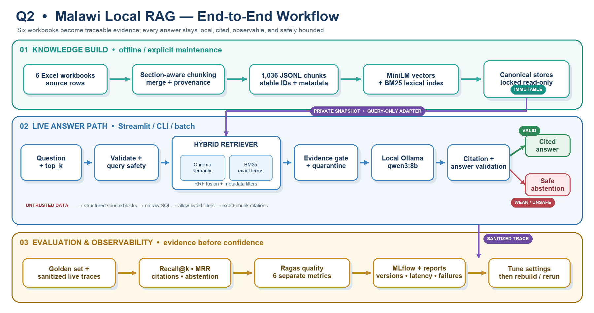

# Q2 Local RAG Demo Design

## Goal

Build a working local assistant over the Malawi IDSR training guides. Answers
must use retrieved evidence, cite stable chunk IDs or section names, expose a
retrieval trace, and return `cannot find in sources` when evidence is weak.

The diagram separates index construction from serving so the canonical stores
can remain locked during normal use. It also shows the two retrieval signals,
guarded answer branches, sanitized traces, and evaluation feedback used to tune
configuration before an explicit rebuild.

## Data model

Each workbook row contains a paragraph number and paragraph text. Ingestion
normalizes extraction artifacts while preserving the original booklet and
paragraph range. Numbered headings, section labels, chapters, annexes, and
short uppercase labels define section boundaries.

Long sections target 1,800 characters and split oversized cells at sentence
boundaries. The current corpus contains 1,036 chunks; chunk size and overlap
are governed by validated settings and must be checked after each rebuild.
Chunks never cross detected sections. Each chunk stores:

- `chunk_id`, for example `TG_Booklet_1:p430-p436:c0066`
- `doc_id` and original `source_file`
- `section` and derived `topic`
- `paragraph_start` and `paragraph_end`
- normalized source `text`

### Row-to-chunk behavior

Workbook rows are input records, not one-to-one chunks. Empty rows are skipped,
and consecutive small rows in the same section are joined with newline separators
until the target size is reached. A heading starts a new section; an oversized row
is split at sentence boundaries. The original paragraph numbers are retained as
`paragraph_start` and `paragraph_end`, so merged rows remain traceable to the
source workbook. For example, TG Booklet 3 has about 2,064 source entries and
produces 213 retrieval chunks. This reduces retrieval fragmentation while keeping
section context and citation provenance.

## Retrieval

The vector path uses normalized `all-MiniLM-L6-v2` embeddings in a persistent
Chroma cosine collection. A local BM25 index runs over the same chunks. The two
ranked lists are combined with reciprocal-rank fusion, which avoids treating
incompatible cosine and BM25 score ranges as though they were calibrated.
The canonical Chroma directory is locked read-only for serving. Because
embedded Chroma needs writable SQLite runtime files, retrieval queries a private
disposable snapshot through an adapter that exposes only `query()`; it cannot
persist mutations to the canonical index. See `docs/READ_ONLY_CHROMA.md` for
deployment commands and limitations.

The default answer context uses six chunks, while each retriever produces at
least 20 candidates before fusion. Trace mode displays both component scores,
the fused score, rank, source metadata, and retrieved content.

## Abstention and answer controls

Generation runs through local Ollama `qwen3:8b` with low temperature and a
bounded answer length. Before generation, the evidence gate requires both a
minimum semantic similarity and minimum query-token coverage. If it fails, the
system returns the exact required phrase without calling the LLM.

The prompt labels retrieved material as untrusted reference content and tells
the model to ignore instructions within it. It also requires an informational
public-health tone and exact bracketed chunk citations. A deterministic output
validator rejects answers with no citation or with any citation outside the
retrieved set, replacing them with `cannot find in sources`.

## Interfaces

- `python ingest.py` creates the normalized JSONL chunk store.
- `python index.py` builds Chroma and BM25 indexes.
- `python rag.py "question" --trace` runs the CLI.
- `streamlit run app.py` launches the interactive demo.

## Current measured state

- Six workbooks ingested.
- 1,036 chunks generated in the current corpus snapshot.
- Chunk lengths are validated during ingestion; rebuilds must record the resulting
  count and manifest before release.
- Vector and BM25 indexes built successfully.
- In-domain retrieval and cited Ollama generation verified.
- Out-of-domain abstention verified.
- Streamlit server startup and HTTP 200 response verified.
- A three-question local Ragas evaluation recorded all six metrics for every
  question. The small sample validates the method; sustained runs were limited
  by MacBook heat, not an observed algorithm failure. See
  `RAGAS_EVALUATION.md`.

Thresholds are initial engineering defaults. They should be calibrated against
the assignment golden set before final submission.
