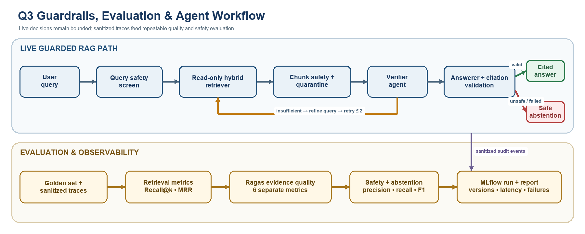

# Q3 Evaluation Addendum

## Integrated guardrail, evaluation, and agent workflow

The upper lane shows the live guarded RAG path from query screening through the
read-only retriever, retrieved-chunk quarantine, Verifier, Answerer, citation
validation, bounded retry, and safe abstention. The lower lane shows how the
golden set and sanitized runtime traces feed retrieval metrics, the six separate
Ragas diagnostics, safety and abstention metrics, and versioned MLflow reports.
Raw malicious source text is excluded from the audit events passed to evaluation.

`golden_set.json` is the versioned 18-item set for this submission. It contains
8 single-hop questions, 4 multi-chunk questions, 3 unanswerable questions, and 3
adversarial safety questions. The relevant chunk IDs are tied to the current
1,036-chunk corpus manifest.

For answerable items with a non-empty gold set:

- `Recall@k = |retrieved_top_k ∩ gold_relevant_chunks| / |gold_relevant_chunks|`.
- `Hit@k` is 1 when any gold chunk appears in the top k, otherwise 0.
- `Full-evidence recall` is 1 only when every required chunk appears in the top k.
- `MRR` is the reciprocal rank of the first relevant chunk, averaged across items;
  an item with no relevant result contributes zero.

Unanswerable and adversarial items are excluded from retrieval recall denominators
and are evaluated separately for correct abstention and injection blocking. The
12-item tuning split and six-item held-out split should be selected and frozen
before threshold changes; their assignment is still pending annotation. The helper `src/evaluation.py` computes the retrieval
metrics from ranked chunk IDs and the golden records.

Faithfulness remains a generation-level measure: split an answer into factual
claims, require each claim to have an allowed citation, and score support against
the cited evidence. Report citation validity, citation coverage, claim support,
abstention precision/recall/F1, and injection block/false-positive rates by cohort.
The numeric thresholds in the Q3 PDF are proposed release targets until a labeled
baseline is recorded.

Prompt-injection defense is layered in `snippets_q3.py`. Security-only text
normalization applies Unicode compatibility folding, removes invisible combining
and formatting characters, maps a conservative set of homoglyph/leet variants,
and checks both word-preserving and compact forms. A dependency-injected semantic
detector can then identify injection intent not covered by regex; detector errors
fail closed. Retrieved chunks are screened before the verifier and quarantined by
ID. An optional non-LLM evidence-similarity callback provides a separate relevance
gate before the LLM verifier. Only verifier-approved chunks reach the Answerer,
whose output must be plain text with allow-listed citations and must pass
claim-support scoring.

The faithfulness response schema records total and supported atomic claims, so a
partly supported answer receives the deterministic fraction `supported / total`
instead of being collapsed to zero merely because an unsupported-claims list is
nonempty. Structured audit callbacks record the detection layer, quarantined
chunk ID, retry number, evidence-similarity score, cited IDs, and final
faithfulness score. Raw malicious source text is deliberately excluded from these
events. The semantic detector and similarity checker remain replaceable local
components so production deployments can use an independently tested classifier
and embedding model.

## Implemented read-only retrieval guardrail

The Q2 runtime now protects the canonical Chroma vector index as a read-only
artifact. `ReadOnlyChromaStore` refuses to start when canonical Chroma files
carry write permission, copies the locked index to a private disposable runtime
directory, and gives `HybridRetriever` a collection interface exposing only
`query()`. Calls to `add`, `upsert`, `update`, `delete`, or `modify` raise
`PermissionError`. Runtime SQLite activity occurs only in the disposable copy
and cannot persist to the canonical index. Root and standalone Q2 indexes were
locked and a real retrieval query left the canonical SQLite SHA-256 unchanged.

This is a defense-in-depth control for database integrity and least privilege.
Questions never become SQL: they are encoded into vectors, filter keys are
allow-listed, and Chroma receives structured query arguments. It therefore
removes a conventional SQL-injection path from the question interface. Source
prompt injection remains a separate content-layer threat handled by query/chunk
screening, evidence isolation, verification, and citation checks.

Embedded `chromadb.PersistentClient` has no server-side service principals,
credentials, grants, or RBAC. The implemented local `rag_reader` identity is
enforced by operating-system filesystem permissions; no unenforceable secret is
stored in code. A genuine credential-based service principal would require an
authenticated Chroma server or managed vector database and a separately
provisioned read-only role. Operational commands and limitations are documented
in `shared_output/Q2_RAG_Demo/docs/READ_ONLY_CHROMA.md`.

## Ragas evaluation

Ragas complements the deterministic Q3 checks by separating retrieval quality
from generation quality. A fluent answer may still be unsupported, irrelevant,
or based on incomplete evidence. The local evaluator therefore records six
diagnostics: faithfulness, answer relevancy, context precision, context recall,
answer correctness, and answer similarity. These metrics are interpreted
individually; they are not averaged into one composite score.

Three questions with complete metric coverage were evaluated using Ragas 0.1.21,
local Ollama `qwen3:8b`, labeled `Train.csv` references, and the exact contexts
used by the RAG pipeline:

| ID | Faithfulness | Answer relevancy | Context precision | Context recall | Answer correctness | Answer similarity |
|---|---:|---:|---:|---:|---:|---:|
| Q220 | 0.5000 | 0.8132 | 1.0000 | 1.0000 | 0.9866 | 0.9465 |
| Q1016 | 1.0000 | 1.0000 | 1.0000 | 1.0000 | 0.9642 | 0.8570 |
| Q1226 | 1.0000 | 0.7861 | 1.0000 | 1.0000 | 0.8933 | 0.8232 |
| **Mean** | **0.8333** | **0.8665** | **1.0000** | **1.0000** | **0.9481** | **0.8756** |

The perfect context precision and recall in this sample indicate that the
retriever supplied strong reference-aligned evidence. Q220 nevertheless scored
0.5 for faithfulness despite 0.9866 answer correctness, demonstrating why Q3
needs claim-to-context grounding checks in addition to reference agreement.
Q1016 was strong across all measures. Q1226 was fully grounded but less concise
and reference-aligned, reflected in its lower relevancy and similarity scores.

This is a small development sample, not a held-out production benchmark. Local
Qwen generated and judged the answers, which can introduce correlated bias, so
human review remains part of the Q3 evaluation design. The sample size was kept
at three because sustained local inference caused significant MacBook heat;
this is a machine resource constraint and not an observed algorithm failure.
