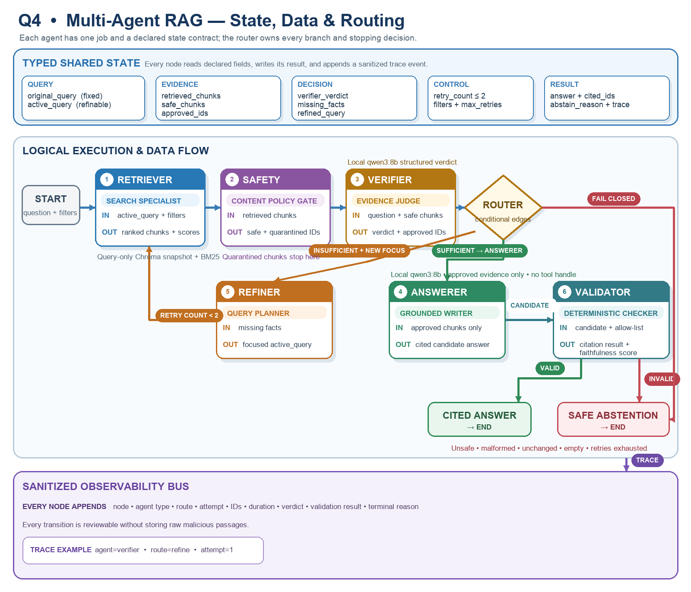

# Q4 Graph-Based Multi-Agent Workflow

The workflow uses one typed `GraphState` as the contract between nodes. The
original query remains fixed while `active_query` may hold a focused refinement.
Each numbered agent card identifies the agent type, input, and output. The
Router is shown separately because it selects conditional edges rather than
performing retrieval, safety, verification, generation, or validation work.

The Verifier creates the central conditional edge:

- Sufficient evidence with allow-listed IDs routes to Answerer and deterministic
  citation and faithfulness validation.
- Incomplete evidence with a changed focused query routes through Refine Query
  and returns to Retriever. At most two return edges are allowed.
- Unsafe evidence, malformed state, unchanged refinement, exhausted retries, or
  invalid answer output routes to the exact safe abstention response and `END`.

The graph remains bounded to at most three retrieval attempts. The Answerer sees
only verifier-approved chunks and receives no retrieval tool handle. Every node
records IDs, routing decisions, duration, attempt number, and terminal reason;
raw malicious passage text is excluded from audit events.
